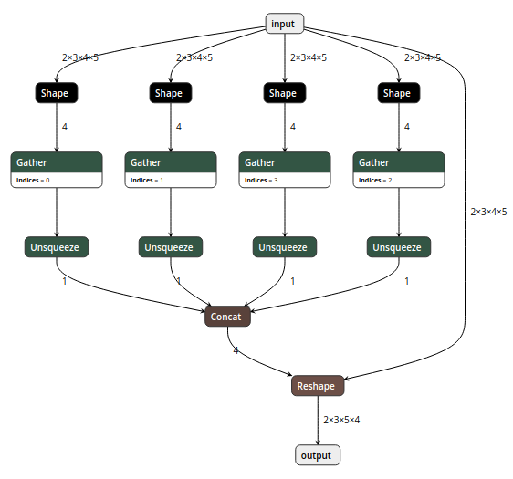
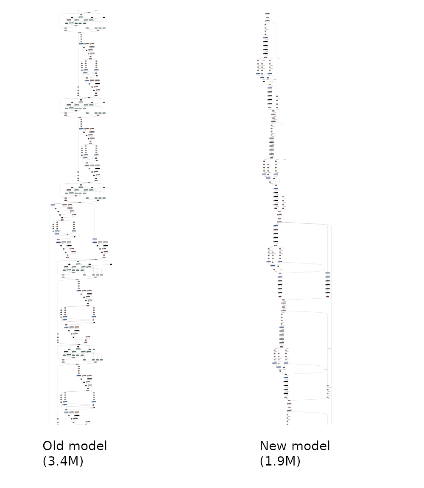

# ONNX Simplifier

[](https://pypi.python.org/pypi/onnx-simplifier/)
[](https://pypi.python.org/pypi/onnx-simplifier/)
[](https://pypi.python.org/pypi/onnx-simplifier/)
[](https://github.com/daquexian/onnx-simplifier/pulls)

_ONNX is great, but sometimes too complicated._

## Background

One day I wanted to export the following simple reshape operation to ONNX:

```python
import torch


class JustReshape(torch.nn.Module):
    def __init__(self):
        super(JustReshape, self).__init__()

    def forward(self, x):
        return x.view((x.shape[0], x.shape[1], x.shape[3], x.shape[2]))


net = JustReshape()
model_name = 'just_reshape.onnx'
dummy_input = torch.randn(2, 3, 4, 5)
torch.onnx.export(net, dummy_input, model_name, input_names=['input'], output_names=['output'])
```

The input shape in this model is static, so what I expected is


However, I got the following complicated model even after
[polishing](https://github.com/onnx/onnx/blob/master/docs/PythonAPIOverview.md#polishing-the-model):



Moreover, there are also some operations performed on weights (like
[this](https://github.com/JDAI-CV/DNNLibrary/issues/17#issuecomment-455934190)), which
can all be eliminated by offline computation.

## Our solution

ONNX Simplifier is presented to simplify the ONNX model. It infers the whole computation graph
and then replaces the redundant operators with their constant outputs.

### Web version

We have published ONNX Simplifier on https://convertmodel.com. It works out of the box and **doesn't need any installation**. Just open the webpage, choose ONNX as the output format, check the onnx simplifier and then select your model to simplify. Note that **the web version is in its very early stage**, if the web version doesn't work well for you, you can install the Python version following the instructions below.

### Python version


```
pip3 install -U pip && pip3 install onnx-simplifier
```

Then

```
python3 -m onnxsim input_onnx_model output_onnx_model
```

For more functions like skipping optimization and setting input shape manually (when input shape is dynamic itself), try the following command for help message

```
python3 -m onnxsim -h
```

## Demonstration

An overall comparison between
[a complicated model](https://github.com/JDAI-CV/DNNLibrary/issues/17#issuecomment-455934190)
and its simplified version:



## In-script workflow

If you would like to embed ONNX simplifier python package in another script, it is just that simple.

```python
import onnx
from onnxsim import simplify

# load your predefined ONNX model
model = onnx.load(path + model_name + '.onnx')

# convert model
model_simp, check = simplify(model)

assert check, "Simplified ONNX model could not be validated"

# use model_simp as a standard ONNX model object
```

You can see more details of the API in [onnxsim/\_\_main\_\_.py](onnxsim/__main__.py)
