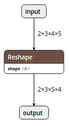
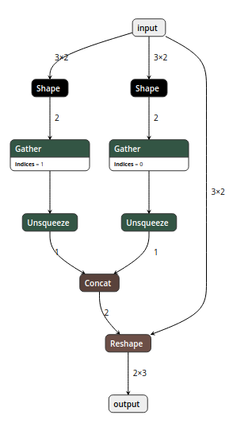

## ONNX Simplifier

ONNX is great, but sometimes too complicated.

For example, we export the following simple reshape operation to ONNX:

```python
import torch

import onnx
import onnx.utils


def polish(model_name):
    model = onnx.load(model_name)
    model = onnx.utils.polish_model(model)
    onnx.save(model, model_name)


class ComplicatedReshape(torch.nn.Module):
    def __init__(self):
        super(ComplicatedReshape, self).__init__()

    def forward(self, x):
        return x.view((x.shape[0], x.shape[1], x.shape[3], x.shape[2]))

net = ComplicatedReshape()
model_name = 'complicated_reshape.onnx'
dummy_input = torch.randn(2, 3, 4, 5)
torch.onnx.export(net, dummy_input, model_name, input_names=['input'], output_names=['output'])

polish(model_name)
```

Dynamic input in [not natively supported](https://github.com/onnx/onnx/issues/654) in ONNX, so what
we expect is



However, what we get is



And also there are some operations performed on weight, as pointed out in https://github.com/onnx/onnx/issues/1758
and https://github.com/JDAI-CV/DNNLibrary/issues/26

This library wants to simplify the ONNX model and remove these redundant operators.

An overall comparison between original model and simplified model:


